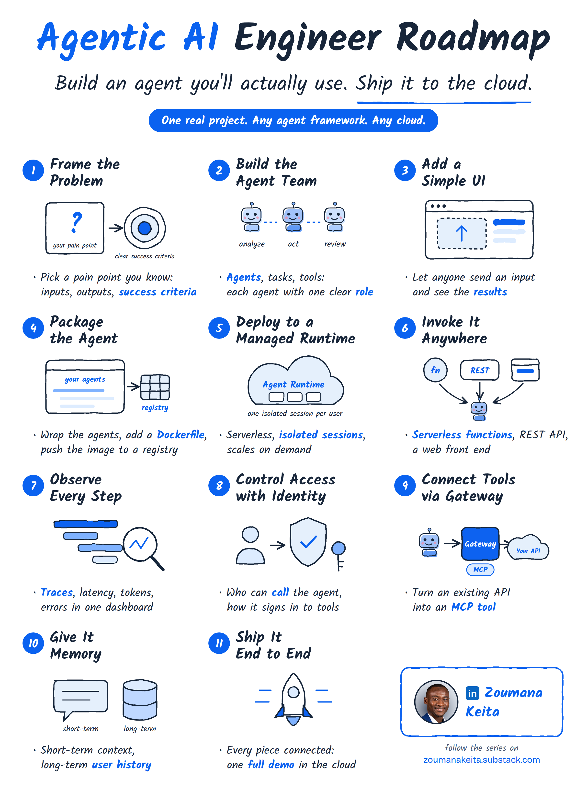
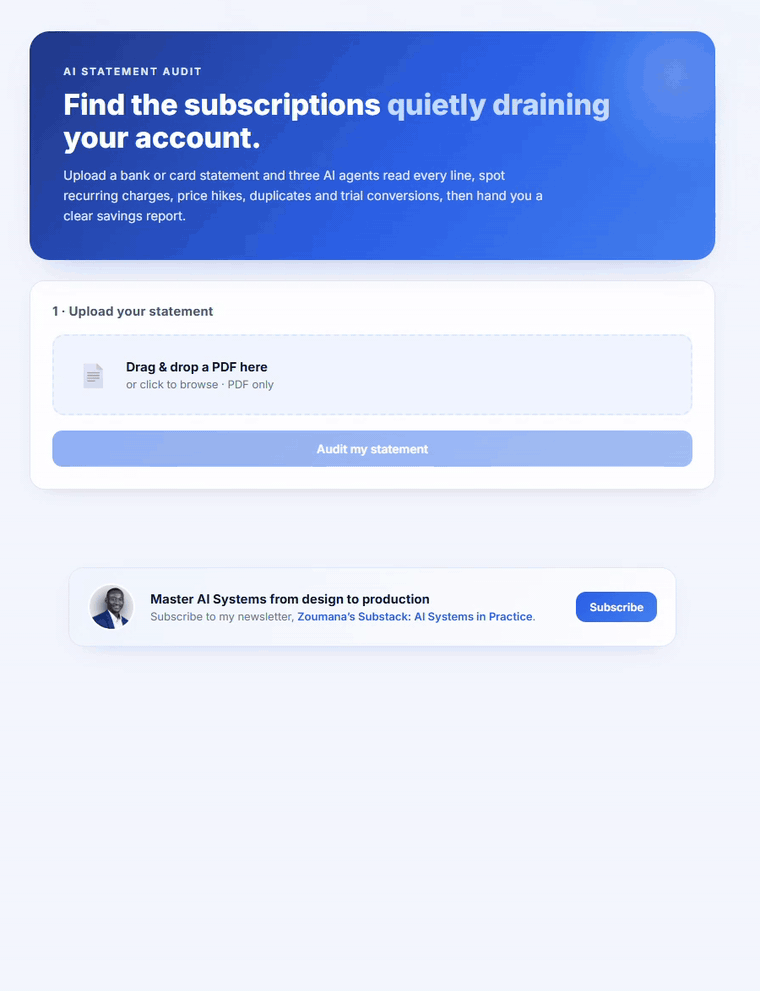

# AI Engineering Roadmap

**Build an AI agent you'll actually use. Ship it to the cloud.**

One real project, taken from a blank folder to production in 11 steps. Any agent framework. Any cloud.

[](https://zoumanakeita.substack.com/subscribe)
[](https://linkedin.com/in/zoumana-keita/)




---

## Why this repository exists

Most agent tutorials stop at the demo. Then you try to build something real, and nothing survives contact with messy data, cloud credentials, permissions, monitoring or a user who is not you.

In my experience, agents rarely fail in production because of the model. They fail because of everything around it: unclear success criteria, unchecked outputs, loose permissions, no visibility, no plan for messy input.

This repository follows **one project** through the full lifecycle of an AI system, one step at a time. Each part comes with:

- **Working code** you can run on your machine
- **A detailed article** on Substack that explains the design decisions, not just the commands
- **Fictional test data with an answer key**, so you can check that the agents are right

## The project: SubscriptionAuditor

Subscriptions are designed to be forgotten: free trials that turn into paid plans, quiet price increases, duplicate charges. SubscriptionAuditor reads a bank statement PDF with a team of three AI agents and returns a savings report with the evidence for every finding.

| Agent | Job |
|---|---|
| **Statement Extractor** | Turns the PDF into a clean list of transactions and checks they add up to the statement totals |
| **Subscription Detective** | Finds recurring charges, price increases, duplicate charges and trials that turned paid, with proof |
| **Savings Reviewer** | Drops anything the evidence does not support and suggests keep, review or ask for a refund |

The agents read and recommend. They never cancel anything: the user makes the final decision.



---

## The roadmap

| Step | Topic | What you build | Code | Article |
|:---:|---|---|---|---|
| 1 | Frame the problem | Pain point, inputs, outputs, success criteria, test data | [Part 1](part-1-agent-team-and-ui/) | [Read](https://zoumanakeita.substack.com/p/build-an-ai-agent-youll-actually) |
| 2 | Build the agent team | Three agents, three tasks, one model on Amazon Bedrock | [Part 1](part-1-agent-team-and-ui/) | [Read](https://zoumanakeita.substack.com/p/build-an-ai-agent-youll-actually) |
| 3 | Add a simple UI | Local web page with uploads, live progress and downloads | [Part 1](part-1-agent-team-and-ui/) | [Read](https://zoumanakeita.substack.com/p/build-an-ai-agent-youll-actually) |
| 4 | Package the agent | Dockerfile, container image, registry | Coming soon | |
| 5 | Deploy to a managed runtime | Serverless runtime with an isolated session per user | Coming soon | |
| 6 | Invoke it anywhere | Serverless functions, REST API, web front end | Coming soon | |
| 7 | Observe every step | Traces, latency, tokens and errors in one dashboard | Coming soon | |
| 8 | Control access with identity | Who can call the agent, how it signs in to tools | Coming soon | |
| 9 | Connect tools via a gateway | Turn an existing API into an MCP tool | Coming soon | |
| 10 | Give it memory | Short-term context and long-term user history | Coming soon | |
| 11 | Ship it end to end | Every piece connected, one full demo in the cloud | Coming soon | |

A new step is published every week. [Subscribe on Substack](https://zoumanakeita.substack.com/subscribe) to get each one the day it goes live.

---

## Repository structure

Each part lives in its own folder and is self-contained: you can run any part without the others.

```text
ai-engineering-roadmap/
├── README.md                          # you are here
├── LICENSE
├── .gitignore                         # keeps secrets, virtual envs and generated files out of git
├── assets/                            # roadmap visuals
└── part-1-agent-team-and-ui/          # steps 1 to 3
    ├── README.md                      # how to run this part
    ├── images/                        # diagrams and demo
    └── subscription_auditor/          # the CrewAI project
        ├── .env.example               # settings template, copy to .env
        ├── pyproject.toml
        ├── ui/                        # FastAPI server and static front end
        └── src/subscription_auditor/
            ├── config/                # agents.yaml, tasks.yaml
            ├── tools/                 # StatementReaderTool
            ├── data/                  # fictional sample statements and answer key
            ├── crew.py
            └── main.py
```

---

## Quick start

You need Python 3.10 to 3.13, [uv](https://docs.astral.sh/uv/), the [CrewAI CLI](https://docs.crewai.com/installation), the [AWS CLI](https://docs.aws.amazon.com/cli/latest/userguide/getting-started-install.html) and an AWS account with access to Claude Sonnet 4.5 on Amazon Bedrock. The [Part 1 README](part-1-agent-team-and-ui/README.md) and article walk through every step, including a least-privilege IAM setup.

```bash
git clone https://github.com/keitazoumana/ai-engineering-roadmap.git
cd ai-engineering-roadmap/part-1-agent-team-and-ui/subscription_auditor

crewai install                 # creates the virtual environment and installs dependencies
cp .env.example .env           # Windows PowerShell: Copy-Item .env.example .env
# fill in MODEL, AWS keys and region in .env

crewai run                     # run the crew from the command line
uv run python ui/server.py     # or start the web UI on http://127.0.0.1:8000
```

---

## Engineering principles

These principles shape every part of the roadmap, whatever the framework or the cloud.

1. **Define success before writing code.** Inputs, outputs and an answer key come first.
2. **One job per agent.** Extraction, analysis and verification fail in different ways, so they are built and tested separately.
3. **Contracts between agents.** Agents hand each other strict formats, not free text.
4. **Verification is a separate role.** The agent that checks the work did not produce it.
5. **Least privilege from day one.** The code can call one model and nothing else.
6. **The human makes the decision.** Advice systems earn trust before they earn autonomy.

---

## Security and data

- **Never commit `.env`** or any credentials. The `.gitignore` in this repository excludes them. If a key is ever pushed by mistake, delete it in IAM right away and create a new one: removing the file from git history is not enough.
- **Use fictional data.** The sample statements in this repository come from the made-up *Bluepine Demo Bank*. Every person, merchant and amount is fictional. Do not upload real bank statements while you build.
- **Least privilege.** The IAM policy used in Part 1 allows calling one model, through one inference profile, and nothing else.

---

## Tech stack

| Layer | Choice in this series | Swappable with |
|---|---|---|
| Agent framework | [CrewAI](https://docs.crewai.com) | LangGraph, Strands Agents, OpenAI Agents SDK, and others |
| Model | Claude Sonnet 4.5 on [Amazon Bedrock](https://aws.amazon.com/bedrock/) | Any capable model and provider |
| UI | FastAPI with a static HTML, CSS and JavaScript front end | Streamlit, Gradio, React |
| Cloud | AWS | Azure, Google Cloud |

---

## About the author

I'm **Zoumana Keita**, a Senior AI/MLOps engineer. I have been shipping machine learning systems since 2017, from IBM to the IFC (World Bank Group), and today I build document intelligence systems at enterprise scale. I help builders master AI systems from design to production.

- Newsletter: [zoumanakeita.substack.com](https://zoumanakeita.substack.com/subscribe)
- LinkedIn: [linkedin.com/in/zoumana-keita](https://linkedin.com/in/zoumana-keita/)

If this repository helps you, **star it** and share what you build. Questions and suggestions are welcome in [Issues](https://github.com/keitazoumana/ai-engineering-roadmap/issues).

## License

Released under the [MIT License](LICENSE).
